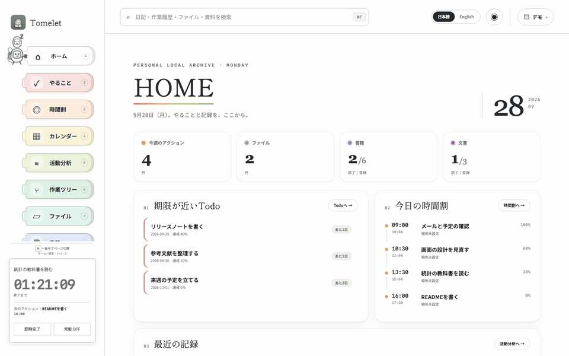

# Tomelet

Tomelet は、日記・時間割・Todo・関連ファイルを一括管理する、macOS / Windows 用の個人向け記録アプリです。

予定を時間割に置き、実行したことと達成度を記録し、あとからカレンダーや活動分析でふりかえれます。データはすべて自分のコンピューターの中（自分で選んだフォルダ）に保存され、外部のサービスには送信されません。

## できること

| 画面 | 内容 |
|---|---|
| ホーム | 今日の時間割、期限が近い Todo、最近の記録をひと目で確認 |
| やること（Todo） | 期限日・達成度・タグ付きの Todo。ファイル・資料・フォルダを添付し、時間割へ取り込んで実行 |
| 時間割 | 24 時間表示で予定を置き、実績時刻・達成度・完了したことを記録。左下のタイマーで実行中の作業を計測 |
| カレンダー | 月・週・日で、アクション・Todo・日記・メモを表示。ドラッグで予定の日付を変更 |
| 活動分析 | 予定と実績、完了率、タグ別の時間、直近 7 日間を自動で集計 |
| 作業ツリー | 時間割のアクションとタグのつながりを表示 |
| ファイル | Todo・時間割に添付したファイルを、名前・関連作業・タグから検索 |
| 書籍・文書 | PDF をドロップして本棚に登録。読書状態、要点、BibTeX などを管理 |

このほか、日記の作成と全文検索、画面上部からの横断検索、タグによる表示の絞り込み、配色とフォントの変更、日本語 / English の切り替えができます。

## 動作環境

- macOS 12 以降、または Windows 10 / 11
- [Node.js](https://nodejs.org/) 22.5 以降
- macOS では Xcode Command Line Tools（`Tomelet.app` と常駐タイマーの作成に使用。ターミナルで `xcode-select --install` を実行して導入します）

## ダウンロード

[Releases](../../releases/latest) ページの「Assets」から `Source code (zip)` をダウンロードし、展開します。

展開したフォルダは、ダウンロードフォルダではなく、今後も置いておく場所（例: ホームフォルダの `Applications` や `Tomelet`）へ移動してください。Tomelet はこのフォルダから起動します。

## インストール

### macOS

1. 展開したフォルダの `Tomelet-Setup.command` をダブルクリックします。
2. 「開発元を確認できない」などの警告が表示された場合は、警告を閉じ、Finder で `Tomelet-Setup.command` を右クリックして「開く」を選びます。
3. セットアップが終わると、同じフォルダに `Tomelet.app` ができます。

`Tomelet.app` はフォルダ内に置いたまま使います。Dock に追加しておくと便利です。フォルダを移動した場合は、もう一度 `Tomelet-Setup.command` を実行してください。

### Windows

1. 展開したフォルダの `Tomelet-Setup.cmd` をダブルクリックします。
2. 「Windows によって PC が保護されました」と表示された場合は、「詳細情報」をクリックしてから「実行」をクリックします。

## 使い方

### 起動と終了

| | macOS | Windows |
|---|---|---|
| 起動 | `Tomelet.app`（または `Tomelet.command`） | `Tomelet.cmd` |
| 終了 | `Tomelet.app` を終了（または `Tomelet-Stop.command`） | `Tomelet-Stop.cmd` |

Windows ではブラウザで画面が開きます（既定は `http://localhost:3174/`）。

### 最初の設定：基準パスを選ぶ

初めて起動すると「基準パスの設定」が表示されます。基準パスは、Tomelet のデータを保存し、書籍・文書・ファイルを参照するときの起点になるフォルダです。

- 新しく始める場合は、フォルダを選んで ID（データの名前）を入力します。フォルダ直下に隠しフォルダ `.kobito-tools/` が作られ、そこにデータが保存されます（Tomelet のデータは `.kobito-tools/Tomelet/`、PopNote! のメモは `.kobito-tools/PopNote/`、両アプリ共通のタグは `.kobito-tools/Tags/`）。以前の版で作られた `.TickTockTome/` は、開いたときに自動で `.kobito-tools/` へ移行し、元のフォルダは `.TickTockTome.migrated/` として残します。
- すでに Tomelet のデータがあるフォルダを選ぶと、そのデータに切り替えます。

基準パスは、あとから「設定 → 基準パス」や、画面右上の ID ボタンから切り替えられます。

### キーボードショートカット

| 操作 | macOS | Windows |
|---|---|---|
| ページの切り替え（ホーム〜文書） | `⌘1`〜`⌘9` | `Ctrl+1`〜`Ctrl+9` |
| 設定 | `⌘0` | `Ctrl+0` |
| 検索 | `⌘F` | `Ctrl+F` |

### Todo から実行まで

1. 「やること」で Todo を登録します。ファイルや書籍・文書、フォルダを添付できます。添付したフォルダはクリックすると Finder（Windows ではエクスプローラー）で開きます。
2. 時間割の「アクションを追加」から、Todo を選んで予定に取り込みます。
3. 左下のタイマーの「即時開始」でアクションを始め、「即時完了」で達成度とメモを記録します。100% に届かなかった作業は、Todo に残して続きを予定できます。

「常駐 ON」にすると、タイマーを小さな独立ウィンドウで表示し続けられます。

### 使い方の画面

ナビゲーションの「？ 使い方」に、計画・ふりかえり・資料整理・基準パス・複数の PC での使い方を、図入りで説明しています。

## メモアプリ PopNote! との連携

会議中などにすぐ書くメモは、macOS 用のクイックメモ [PopNote!](https://github.com/kobito-tools/PopNote) で書けます。PopNote! の保存先に Tomelet の基準パスを選ぶと、書いたメモが Tomelet のカレンダーや横断検索に並びます。画面右上の「✎」からも PopNote! を開けます。

## データの保存場所

| データ | 保存場所 |
|---|---|
| 日記・時間割・Todo・書籍や文書の情報・表紙画像 | 基準パス直下の `.kobito-tools/Tomelet/` |
| PopNote! のメモ | 基準パス直下の `.kobito-tools/PopNote/` |
| タグ（Tomelet と PopNote! で共有） | 基準パス直下の `.kobito-tools/Tags/` |
| 書籍・文書の PDF、添付したファイル・フォルダ | 元の場所のまま（コピーせず、基準パスからの位置だけを記録） |
| このコンピューターの設定（現在の基準パスなど） | macOS: `~/Library/Application Support/TickTockTome/`、Windows: `%LOCALAPPDATA%\TickTockTome\` |

基準パスを Google Drive などの同期フォルダにすると、別のコンピューターでも同じフォルダを選ぶだけで同じデータを開けます。ただし、複数のコンピューターで同時に開くと変更が失われるおそれがあるため、切り替えるときは先に Tomelet を終了し、同期の完了を確認してください（同時に開こうとすると確認が表示されます）。

データベースを変更する操作（完全削除や、アップデートによる表の変更）の前には、自動でバックアップを `.kobito-tools/Tomelet/backups/` に作ります。

## アップデート

1. Tomelet を終了します。
2. 新しい版を[ダウンロード](#ダウンロード)して展開し、古いフォルダと置き換えます。
3. `Tomelet-Setup.command`（Windows では `Tomelet-Setup.cmd`）を実行します。

データは基準パスにあるため、アップデートしても消えません。

## トラブルシューティング

### セットアップの画面がすぐ閉じる・「node が見つからない」と表示される

Node.js 22.5 以降がインストールされているか確認してください。インストールした直後は、ターミナル（Windows ではコマンドプロンプト）を開き直してから再度実行してください。

### 「macOSアプリの生成に失敗しました」と表示される（macOS）

Xcode Command Line Tools が必要です。ターミナルで `xcode-select --install` を実行してから、もう一度 `Tomelet-Setup.command` を実行してください。

### 「このデータは使用中です」と表示される

別のコンピューターで同じ基準パスを開いています。そちらの Tomelet を終了し、同期が終わってから開き直してください。相手側を終了できない場合だけ、確認画面からこのコンピューターで開けます。

### 書籍・文書・ファイルが「要再リンク」と表示される

参照しているファイルが基準パスの外にあるか、移動・削除されています。「設定」の「要再リンク」から選び直してください。

## アンインストール

1. Tomelet を終了し、展開したフォルダを削除します。
2. このコンピューターの設定も削除する場合は、[データの保存場所](#データの保存場所)にある `TickTockTome` フォルダを削除します。

日記などのデータは、基準パスの `.kobito-tools/` に残ります。不要な場合は、このフォルダも削除してください。

## プライバシー

Tomelet は外部と通信しません。画面とデータのやりとりは、同じコンピューターの中（`127.0.0.1`）だけで行います。活動分析や PDF の読み取りに使うローカル LLM は初期状態では無効で、有効にした場合もモデルの自動ダウンロードや外部 API への送信は行いません。

## ライセンス

本ソフトウェアは [MIT License](LICENSE) のもとで提供されています。同梱のフォント（Noto Sans JP、Rounded M+ 1c、Yomogi、Shippori Mincho）は SIL Open Font License 1.1 のもとで再配布しています（[`assets/fonts/`](assets/fonts/)）。

本ソフトウェアは現状のまま提供され、いかなる保証もありません。本ソフトウェアの使用によって生じたいかなる損害についても、作者は責任を負いません。詳細は [LICENSE](LICENSE) を参照してください。

## 開発について

本ソフトウェアの開発には、ChatGPT（OpenAI）および Claude（Anthropic）を使用しています。本プロジェクトは個人によるものであり、OpenAI および Anthropic とは関係ありません。

データの保存方法、他アプリとの連携 API、開発用のコマンドについては [docs/DEVELOPMENT.md](docs/DEVELOPMENT.md) を参照してください。不具合の報告や要望は [Issues](../../issues) で受け付けています。
